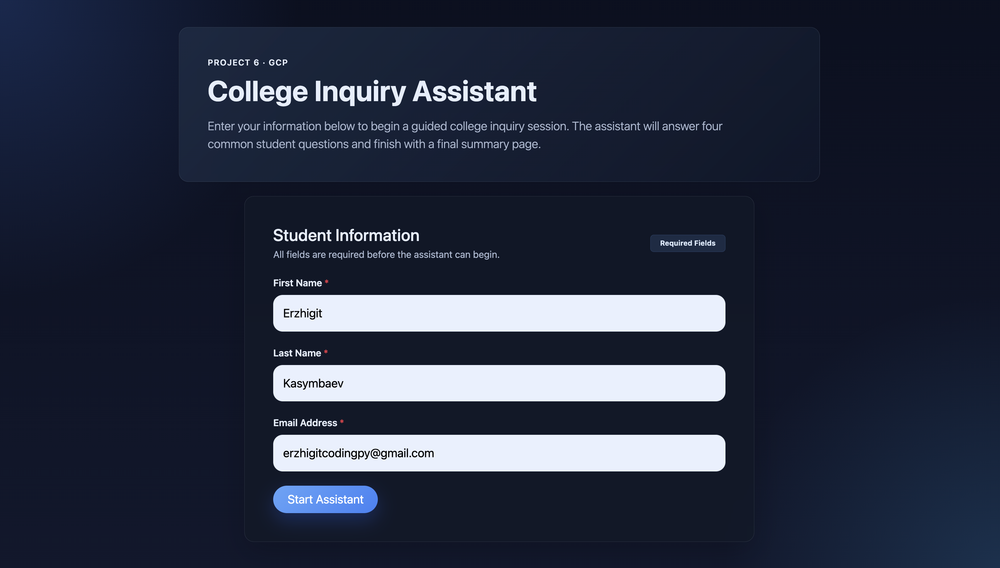
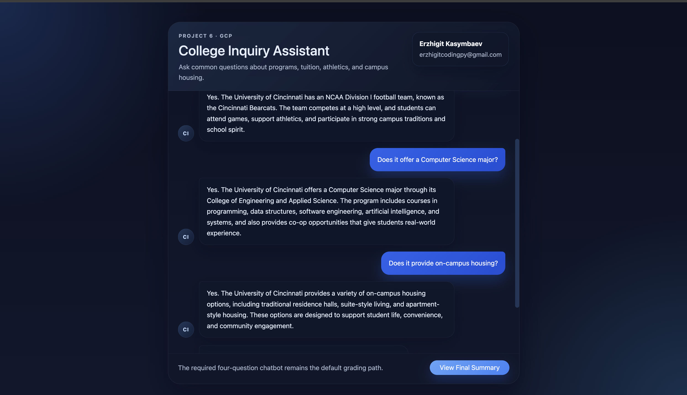
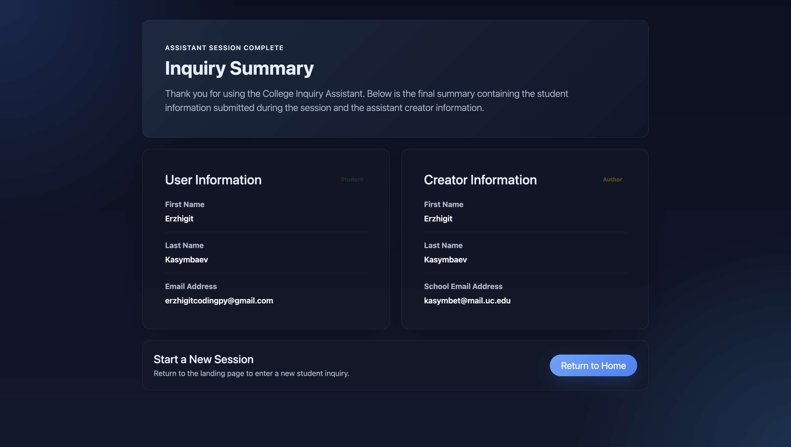

# 🎓 College Inquiry Chatbot

<div align="center">

**A cloud-based college inquiry chatbot built with FastAPI and deployed on Google Cloud Platform (GCP).**

It helps students ask common college-related questions such as academics, tuition, athletics, and housing.  
The project also includes an **optional Gemini-powered bonus assistant** for free-text questions.


</div>

---

## ✨ Overview

This project was developed for **Project 6: GCP**.  
The goal is to create an interactive college inquiry chatbot that:

- collects a student's **first name**, **last name**, and **email address**
- provides **4 predefined student inquiry questions**
- returns **detailed answers** for each question
- shows a **final summary page**
- is deployable on **Google Cloud Platform**

In addition to the required rubric-based chatbot flow, this project includes a **bonus AI assistant mode** powered by **Gemini**, which can answer free-text questions within a controlled college-information scope.

---

## 🧭 App Modes

| Mode | Purpose | Input Type | Used For |
|------|---------|------------|----------|
| **Required Chatbot Mode** | Main graded project flow | Predefined question prompts | Assignment / TA review |
| **Gemini Bonus Mode** | Optional enhancement | Free-text custom questions | Extra feature demo |

---

## ✅ Required Features

- Interactive chatbot flow for collecting:
  - First Name
  - Last Name
  - Email Address
- Four common student inquiry questions
- Detailed answer for each predefined question
- Final summary page showing:
  - user information
  - chatbot creator information
- Public GCP deployment support

---

## 🤖 Bonus AI Assistant

This project also includes an optional **Gemini integration** inside a separate `bonus_ai/` module.

### Bonus mode supports:
- free-text user questions
- controlled college assistant behavior
- guardrails to reduce unsupported answers
- clean separation from the required rubric flow

### Important
The Gemini feature is a **bonus enhancement only**.  
The **required chatbot flow remains the default and grading-safe path**.

---

## 📸 Screenshots

### Landing Page


### Chat Interface


### Final Summary


---

## 🛠 Tech Stack

* **Backend:** FastAPI
* **Templating:** Jinja2
* **Frontend Styling:** Custom CSS
* **Cloud Deployment:** Google App Engine
* **Optional AI Integration:** Gemini API
* **Environment Management:** `.env`

---

## 📂 Project Structure

```bash
gcp-chatbot/
├── bonus_ai/
│   ├── __init__.py
│   ├── college_facts.py
│   ├── gemini_client.py
│   ├── prompts.py
│   ├── README.md
│   └── schemas.py
├── static/
│   └── style.css
├── templates/
│   ├── chat.html
│   ├── index.html
│   └── summary.html
├── app.yaml
├── main.py
├── requirements.txt
└── test.py
```

---

## 💡 Predefined Student Questions

The chatbot supports the following required questions:

1. **Does the college have a football team?**
2. **Does it offer a Computer Science major?**
3. **What is the in-state tuition?**
4. **Does it provide on-campus housing?**

These questions are mapped to detailed fixed responses in the application.

---

## 🚀 Getting Started

### 1. Clone the repository

```bash
git clone <your-repo-url>
cd gcp-chatbot
```

### 2. Create and activate a virtual environment

#### macOS / Linux

```bash
python3 -m venv venv
source venv/bin/activate
```

#### Windows

```bash
python -m venv venv
venv\Scripts\activate
```

### 3. Install dependencies

```bash
pip install -r requirements.txt
```

---

## 🔐 Environment Variables

Create a `.env` file in the project root:

```env
GEMINI_API_KEY=your_gemini_api_key_here
```

> The Gemini key is only needed if you want to use the **bonus AI assistant mode**.

---

## ▶️ Run Locally

Start the FastAPI application with:

```bash
uvicorn main:app --reload
```

Then open:

```bash
http://127.0.0.1:8000
```

---

## ☁️ Deploy to Google App Engine

This project is configured for **Google App Engine** using `app.yaml`.

### Deploy command

```bash
gcloud app deploy
```

### Example `app.yaml`

```yaml
runtime: python311
entrypoint: gunicorn -w 2 -k uvicorn.workers.UvicornWorker main:app
```

After deployment, your app will be available through a public GCP URL that can be submitted for grading.

---

## 🧠 How Gemini Bonus Mode Works

The bonus AI assistant is implemented inside the `bonus_ai/` folder and is kept separate from the core required chatbot logic.

### It includes:

* `college_facts.py` — configured facts used to ground responses
* `prompts.py` — assistant instructions and fallback messages
* `gemini_client.py` — Gemini request handling
* `schemas.py` — basic typed data structures

### Guardrail behavior

If a question falls outside the configured college facts, the assistant returns a safe fallback response instead of inventing unsupported details.

---

## 📋 Example College Facts Used in Bonus Mode

* The college has an intercollegiate football team.
* The college offers a Computer Science major.
* In-state tuition is approximately **$11,500** per academic year.
* The college provides on-campus housing options.

---

## 👤 Creator Information

**Chatbot Creator:** Erzhigit Kasymbaev
**School Email:** [kasymbet@mail.uc.edu](mailto:kasymbet@mail.uc.edu)

---

## 🎯 Project Goals

This project demonstrates:

* FastAPI-based full-stack web development
* template-driven chatbot UI design
* Google Cloud deployment
* optional LLM integration as a modular enhancement
* clear separation between required academic scope and bonus features

---

## 🧪 Future Improvements

Possible next improvements:

* better chat UI polish
* assistant avatars / typing indicators
* session-based chat history
* cleaner deployment documentation
* stronger Gemini grounding and validation
* improved mobile responsiveness

---

## 📄 License

This project was created for academic/course use.

---

## 🙌 Acknowledgment

Built as part of a **Cloud Computing course project** using **Google Cloud Platform** and **FastAPI**.
